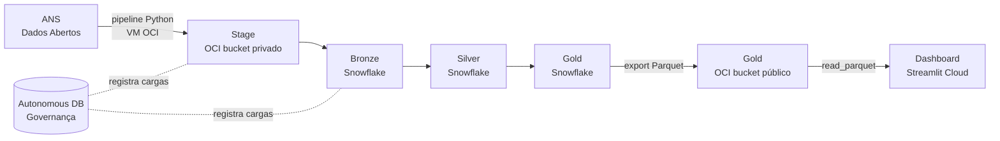

# Data Lake ANS — Beneficiários de Saúde Suplementar

> Plataforma de dados *end-to-end* que processa dados abertos da ANS (Agência Nacional de Saúde Suplementar), demonstrando os pilares da Engenharia de Dados sobre infraestrutura 100% gratuita.

<p align="center">
  
  
  
  
  
</p>

<p align="center">
  <a href="https://dashboard-ans-al.streamlit.app"><b>🔗 Acessar o Dashboard</b></a>
</p>

---

## Índice

- [Visão Geral](#visão-geral)
- [Contexto de Negócio](#contexto-de-negócio)
- [Arquitetura](#arquitetura)
- [Stack Tecnológico](#stack-tecnológico)
- [Camadas de Dados](#camadas-de-dados)
- [Governança de Indicadores](#governança-de-indicadores)
- [Dashboard](#dashboard)
- [Como Executar](#como-executar)
- [Estrutura do Repositório](#estrutura-do-repositório)
- [Roadmap](#roadmap)
- [Licença](#licença)

---

## Visão Geral

Este projeto implementa um **Data Lake completo** que ingere, transforma e disponibiliza
os dados públicos de beneficiários de planos de saúde do estado de **Alagoas**, publicados
mensalmente pela ANS. O período coberto vai de **abril/2019 a abril/2026** (85 competências).

A solução percorre todo o ciclo de vida do dado — da ingestão bruta à entrega analítica —
adotando o padrão **Medallion** (Bronze, Silver, Gold) e práticas profissionais de
**governança**, **idempotência** e **controle incremental**.

---

## Contexto de Negócio

> **Problema:** Em organizações de grande porte, é comum que múltiplas áreas calculem o mesmo
> indicador com regras divergentes, gerando inconsistências nos relatórios gerenciais e
> dificultando a tomada de decisão baseada em dados.

**Solução adotada:** centralização das definições em um repositório único de indicadores,
sob a responsabilidade de um **Data Owner corporativo**. As áreas consomem os indicadores,
mas não alteram suas regras de cálculo — garantindo consistência e rastreabilidade,
em conformidade com o framework **DAMA-DMBOK**.

---

## Arquitetura



A arquitetura combina um **Data Lake** (OCI Object Storage) com um **Data Warehouse**
(Snowflake), conectados por pipelines Python executados em uma VM da OCI. Toda carga é
registrada no **Autonomous Database**, que atua como fonte de verdade da governança.

---

## Stack Tecnológico

| Camada | Tecnologia | Função |
|--------|-----------|--------|
| **Orquestração** | Python 3.10 · Poetry | Pipelines ETL e gestão de dependências |
| **Data Lake** | OCI Object Storage | Armazenamento de arquivos Parquet |
| **Governança** | OCI Autonomous Database | Registro e auditoria das cargas |
| **Data Warehouse** | Snowflake | Camadas Bronze, Silver e Gold |
| **Visualização** | Streamlit Cloud | Dashboard analítico público |
| **Infraestrutura** | OCI Compute (VM Ubuntu) | Execução agendada via cron |

> Toda a stack roda em camadas gratuitas: OCI Always Free, Snowflake Trial e Streamlit Community Cloud.

---

## Camadas de Dados

O projeto segue o padrão **Medallion**, refinando o dado a cada camada:

| Camada | Descrição | Tecnologia |
|--------|-----------|-----------|
| **Stage** | Dado bruto convertido para Parquet, particionado por UF e competência | OCI Object Storage |
| **Bronze** | Ingestão do dado bruto com metadados, carga incremental | Snowflake |
| **Silver** | Limpeza, tipagem e padronização via *views* | Snowflake |
| **Gold** | Agregações e indicadores prontos para consumo | Snowflake → Parquet OCI |

**Particionamento no Data Lake** (padrão Hive):

```
ans/beneficiarios/uf=AL/ano_mes=2026-04/pda-024-icb-AL-2026_04.parquet
```

---

## Governança de Indicadores

Os indicadores seguem o padrão **DAMA-DMBOK**, com ficha técnica completa — código, regra
de cálculo, nível hierárquico, natureza e *data owner* responsável.

| Código | Indicador | Nível | Natureza | Regra de Cálculo |
|--------|-----------|-------|----------|------------------|
| `IND-2026-0001` | Beneficiários Ativos | Operacional | Lagging | `SUM(qt_beneficiario_ativo)` |
| `IND-2026-0002` | Beneficiários Aderidos | Operacional | Leading | `SUM(qt_beneficiario_aderido)` |
| `IND-2026-0003` | Beneficiários Cancelados | Operacional | Lagging | `SUM(qt_beneficiario_cancelado)` |

Adicionalmente, cada execução do pipeline é registrada no Autonomous Database
(tabela `pipeline_execution`), permitindo rastreabilidade completa: status da carga,
volume de registros e janela de execução por competência.

---

## Dashboard

O dashboard público é composto por seis seções:

| Seção | Conteúdo |
|-------|----------|
| 🏠 **Início** | KPIs gerais e evolução mensal de beneficiários |
| 📊 **Análise** | Filtros dinâmicos por ano e métrica |
| 🏢 **Operadoras** | Ranking, taxa de cancelamento e distribuição por modalidade |
| 👥 **Perfil** | Pirâmide etária e distribuição por sexo |
| 📋 **Glossário** | Ficha técnica dos indicadores (padrão DAMA) |
| 🔍 **Governança** | Rastreabilidade técnica do pipeline |

🔗 **[dashboard-ans-al.streamlit.app](https://dashboard-ans-al.streamlit.app)**

---

## Como Executar

### Pré-requisitos

- Python 3.10 ou superior
- `pip`

### Execução local

```bash
# Clone o repositório
git clone https://github.com/DalissonSilva/datalake-dashboard-ans.git
cd datalake-dashboard-ans

# Instale as dependências
pip install -r requirements.txt

# Execute o dashboard
streamlit run app.py
```

> O dashboard lê os dados diretamente das URLs públicas do bucket Gold na OCI —
> não requer credenciais nem configuração de banco.

### Deploy no Streamlit Cloud

1. Faça o *fork* deste repositório
2. Acesse [share.streamlit.io](https://share.streamlit.io)
3. Selecione o repositório e o arquivo `app.py`
4. Clique em **Deploy**

---

## Estrutura do Repositório

```
datalake-dashboard-ans/
├── app.py                  # Página inicial — KPIs e evolução
├── pages/
│   ├── 01_analise.py       # Análise detalhada com filtros
│   ├── 02_operadoras.py    # Ranking de operadoras
│   ├── 03_perfil.py        # Perfil dos beneficiários
│   ├── 04_glossario.py     # Glossário de indicadores (DAMA)
│   └── 05_governanca.py    # Rastreabilidade do pipeline
├── utils/
│   ├── conexao.py          # Leitura dos Parquets do bucket OCI
│   └── queries.py          # Catálogo de indicadores
├── .streamlit/
│   └── config.toml         # Tema visual
├── requirements.txt
└── README.md
```

---

## Roadmap

- [x] Pipeline ANS — Stage e Bronze
- [x] Camadas Silver e Gold
- [x] Dashboard público no Streamlit Cloud
- [x] Glossário de indicadores (padrão DAMA)
- [ ] Pipeline de dados financeiros (68 ativos globais)
- [ ] Camada de qualidade de dados
- [ ] Modelos de previsão (séries temporais)

---

## Licença

Distribuído sob a licença MIT. Consulte o arquivo `LICENSE` para mais detalhes.

---

<p align="center">
  <sub>Projeto de portfólio · Engenharia de Dados · OCI · Snowflake · Python · Streamlit</sub>
</p>
