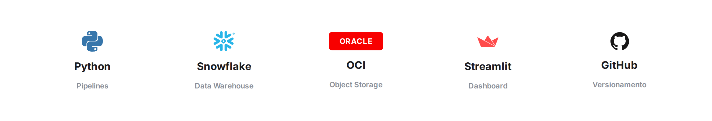
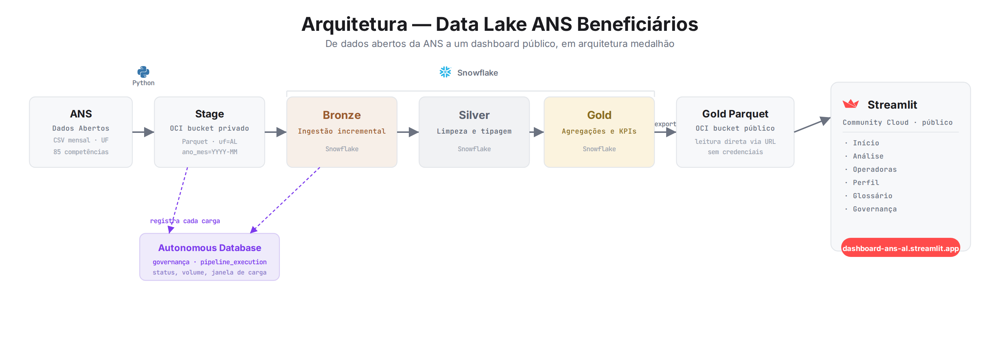
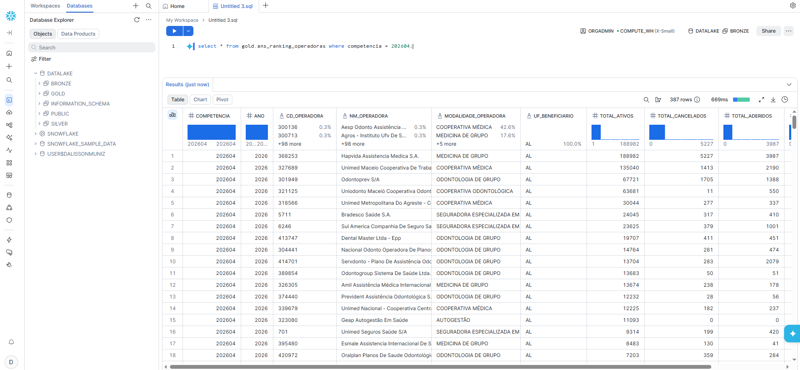
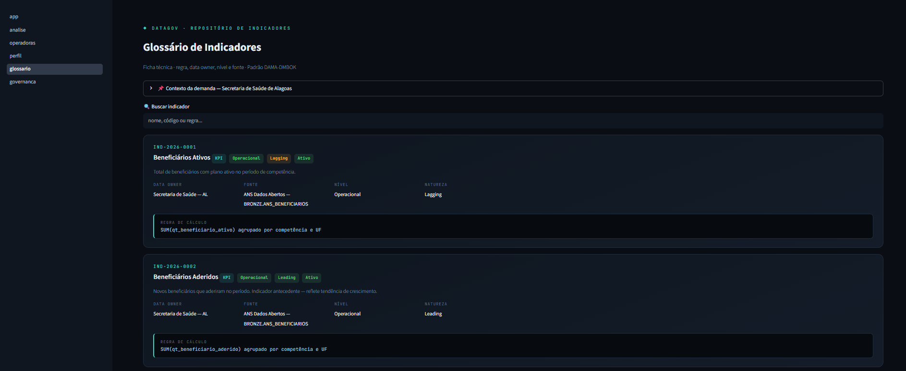
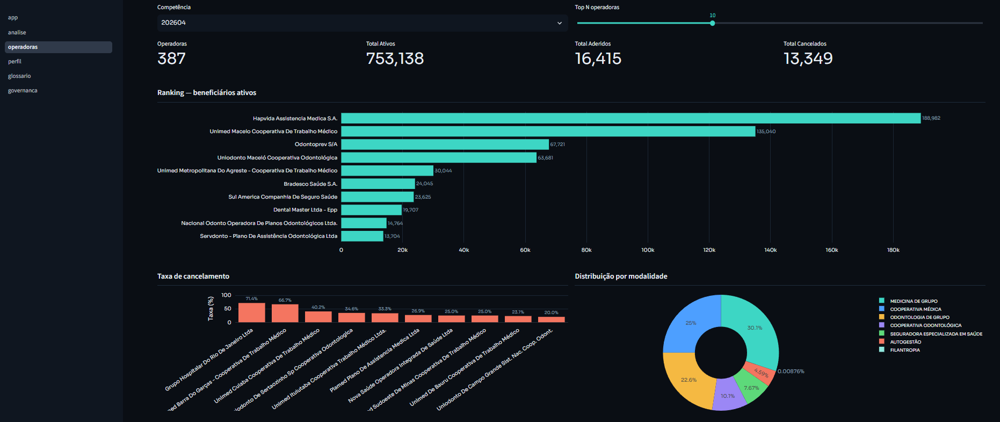

# Data Lake ANS — Beneficiários de Saúde Suplementar

Plataforma de dados que ingere, transforma e disponibiliza os dados públicos
de beneficiários de planos de saúde do estado de Alagoas, publicados
mensalmente pela ANS (Agência Nacional de Saúde Suplementar). Período
coberto: abril/2019 a abril/2026 — 85 competências.

Projeto de portfólio, construído sobre infraestrutura 100% gratuita
(OCI Always Free, Snowflake Trial, Streamlit Community Cloud).

**[→ Acessar o dashboard ao vivo](https://dashboard-ans-al.streamlit.app)**
— sem cadastro, sem senha, dados reais.



## A pergunta de negócio

Em organizações grandes é comum cada área calcular o mesmo indicador com
regras diferentes — cada setor com sua planilha, sua definição, seu
critério de extração. O resultado é previsível: reuniões onde ninguém
concorda com os números.

Essa não é uma situação hipotética. É uma dor real, vivida em projetos
anteriores, onde um indicador estratégico como volume de beneficiários
ativos chegava a números diferentes dependendo de quem calculava —
Financeiro, Operações e TI, cada um com o seu.

Alagoas tem dezenas de operadoras de plano de saúde atuando ao mesmo
tempo, com dados dispersos e sem padronização. Sem uma plataforma
estruturada, perguntas simples ficam sem resposta confiável:

- Quantos alagoanos têm plano de saúde ativo hoje?
- Quais operadoras concentram mais cancelamentos?
- Como evoluiu a cobertura de saúde suplementar nos últimos 7 anos?
- Qual o perfil etário e por sexo dos beneficiários?

A resposta não foi "mais uma planilha". Foi centralizar a definição de
cada indicador num repositório único, sob um *data owner* corporativo —
as áreas consomem o indicador, mas não alteram a regra de cálculo.

## Arquitetura



O pipeline combina um **Data Lake** (OCI Object Storage) com um
**Data Warehouse** (Snowflake), ligados por scripts Python rodando numa
VM da OCI. Toda carga é registrada no **Autonomous Database**, que
funciona como fonte de verdade da governança — não é um log solto, é uma
tabela consultável (`pipeline_execution`) com status, volume processado
e janela de execução de cada competência.

## Camadas de dados

| Camada | O que faz | Onde vive |
|---|---|---|
| Stage | Dado bruto convertido para Parquet, particionado por UF e competência | OCI Object Storage |
| Bronze | Ingestão com metadados, carga incremental | Snowflake |
| Silver | Limpeza, tipagem e padronização via views | Snowflake |
| Gold | Agregações e indicadores prontos para consumo | Snowflake → Parquet no OCI |

Particionamento no Data Lake, padrão Hive:

```
ans/beneficiarios/uf=AL/ano_mes=2026-04/pda-024-icb-AL-2026_04.parquet
```


*`gold.ans_ranking_operadoras` — 387 operadoras retornadas em 669ms,
dentro do catálogo `DATALAKE`, com os schemas `BRONZE`, `SILVER` e `GOLD`
visíveis à esquerda. Não é uma promessa no README — é uma tabela de
verdade, consultável.*

## Governança de indicadores

Cada indicador segue o padrão DAMA-DMBOK, com ficha técnica completa:
código, regra de cálculo, nível hierárquico, natureza e *data owner*.

| Código | Indicador | Nível | Natureza | Regra de cálculo |
|---|---|---|---|---|
| `IND-2026-0001` | Beneficiários Ativos | Operacional | Lagging | `SUM(qt_beneficiario_ativo)` |
| `IND-2026-0002` | Beneficiários Aderidos | Operacional | Leading | `SUM(qt_beneficiario_aderido)` |
| `IND-2026-0003` | Beneficiários Cancelados | Operacional | Lagging | `SUM(qt_beneficiario_cancelado)` |

Essa ficha técnica fica pública, dentro do próprio dashboard — não é
documentação que só quem tem acesso ao banco enxerga.


*Cada indicador mostra a regra de cálculo, o data owner, o nível
(operacional/tático) e a natureza (leading/lagging) — direto na
interface, sem precisar abrir o banco de dados.*

## O dashboard

Seis páginas, todas lendo Parquet público direto do bucket Gold — sem
precisar de credencial nem de conexão com o Snowflake depois que o dado
é exportado.

| Página | Conteúdo |
|---|---|
| Início | KPIs gerais e evolução mensal de beneficiários |
| Análise | Filtros dinâmicos por ano e métrica |
| Operadoras | Ranking, taxa de cancelamento, distribuição por modalidade |
| Perfil | Pirâmide etária e distribuição por sexo |
| Glossário | Ficha técnica dos indicadores (padrão DAMA) |
| Governança | Rastreabilidade técnica do pipeline |


*387 operadoras ativas em Alagoas na competência 202604, com filtro de
Top N interativo e taxa de cancelamento calculada por operadora — não
uma planilha estática, um filtro real.*

**[→ dashboard-ans-al.streamlit.app](https://dashboard-ans-al.streamlit.app)**

## Como executar localmente

```bash
git clone https://github.com/DalissonSilva/datalake-dashboard-ans.git
cd datalake-dashboard-ans
pip install -r requirements.txt
streamlit run app.py
```

O dashboard lê os dados direto das URLs públicas do bucket Gold — não
precisa de credencial nem de banco configurado para rodar local.

## Estrutura do repositório

```
datalake-dashboard-ans/
├── app.py                  página inicial — KPIs e evolução
├── pages/
│   ├── 01_analise.py       análise detalhada com filtros
│   ├── 02_operadoras.py    ranking de operadoras
│   ├── 03_perfil.py        perfil dos beneficiários
│   ├── 04_glossario.py     glossário de indicadores (DAMA)
│   └── 05_governanca.py    rastreabilidade do pipeline
├── utils/
│   ├── conexao.py          leitura dos Parquets do bucket OCI
│   └── queries.py          catálogo de indicadores
├── .streamlit/config.toml  tema visual
└── requirements.txt
```

## Estado atual

Todas as fases já entregues: ingestão incremental das 85 competências,
governança com controle de carga auditável, camadas Silver e Gold
transformadas, catálogo de indicadores publicado, dashboard no ar.

## Licença

Distribuído sob a licença MIT — veja [LICENSE](LICENSE).

## Autor

Dalisson Silva · [LinkedIn](https://www.linkedin.com/in/dalisson-silva-a01a591a7/) · [GitHub](https://github.com/DalissonSilva)